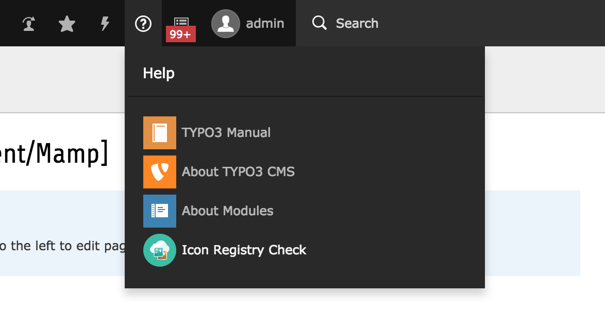
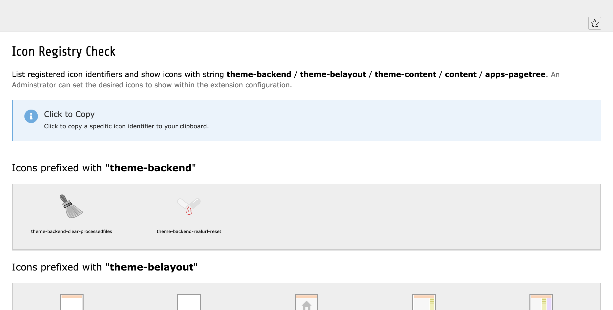
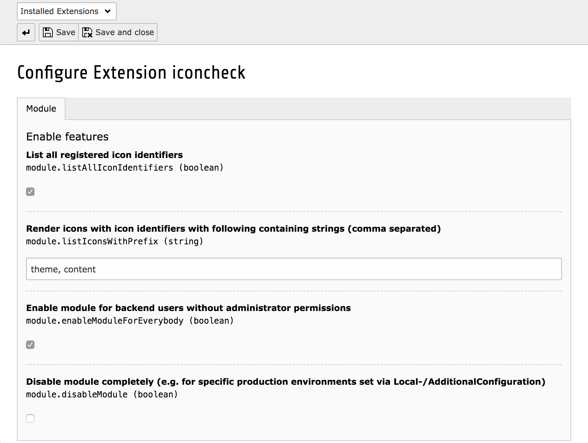

# TYPO3 extension `josefglatz/iconcheck`

## A TYPO3 backend module which shows registered icon identifiers and list specific icons based on a configurable strings.

> Useful for TYPO3 integrators and developers

### Screenshots

#### Open the module

---

#### Preview of the backend module

> [Complete screenshot of the backend module](https://github.com/josefglatz/iconcheck/blob/master/Resources/Public/Images/Documentation/TYPO3-8.7-Module-complete.png?raw=true)

---

#### Extension Configuration

---