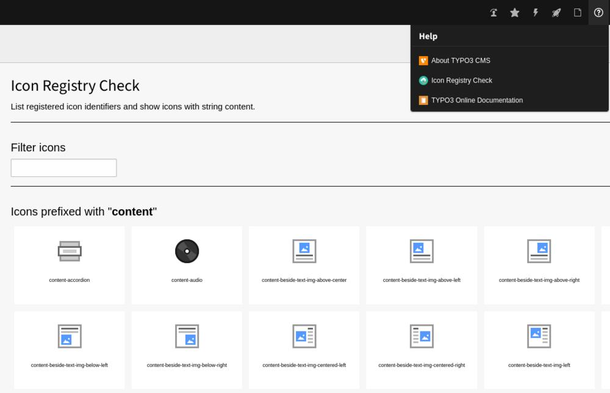

# TYPO3 extension `josefglatz/iconcheck`

A TYPO3 backend module which shows registered icons and their identifiers
identifiers. Optionally limited to configurable prefixes

## Installation

Install via composer from the command line:
`composer require josefglatz/iconcheck`

## Configuration

The extension has two options in the
`$GLOBALS['TYPO3_CONF_VARS']['EXTENSIONS']['iconcheck']` array. Both options
can be set manually, like the file `config/system/additional.php` or via the
Extension Manager:

`'listIconsWithPrefix'` (string, default: `'theme, content'`): Show a list of
icons with a preview which start with one of the strings in the comma
separated list.

`'listAllIconIdentifiers'` (boolean, default: `true`) Show a simple list,
without a preview, of all registered icon identifiers.

## License

GPL 3 or later, at your option. See the file [LICENSE](./LICENSE) or
<https://www.gnu.org/licenses/gpl-3.0.html> for details.
